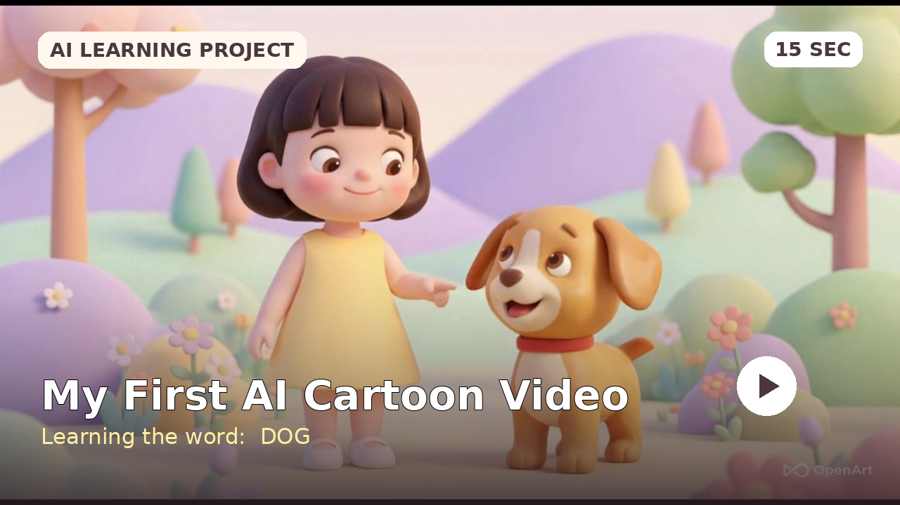

# 🎬 My First AI Cartoon Video — “Dog”

A simple three-scene AI-generated cartoon created as part of my journey learning to build with AI — starting from zero coding background.

## ▶️ Watch the Video

Here is my completed 15-second animation:

<!-- DRAG THE VIDEO FILE DIRECTLY BELOW THIS LINE -->

## 🌟 About This Project

The aim was to create a short and easy-to-understand educational video:

1. A cute girl smiles at the audience.
2. Her pet dog appears.
3. The girl points to the dog and says **“Dog.”**

The final video combines AI-generated characters, animation, voice-over and background music.

## 💡 What I Learned

This was one of the more challenging projects in my AI journey because image generation does not always produce exactly what I have in mind.

I learned that **creating the character is the backbone of the project**. If the character is not right from the beginning, it becomes much harder to maintain consistency across the different scenes.

Creating a good picture is only the first step. Adding natural movement, expression and personality to the character requires another set of skills.

In future projects, I hope to learn how to create more character movements and make my animations feel more natural and lively.

## 🛠️ Tool Used

I used **OpenArt** throughout this creative journey.

## 🎨 Creative Process

**Idea → Character creation → Scene generation → Animation → Voice-over → Music → Final editing**

This project reminded me that even a simple 15-second video can involve many small creative decisions, experiments and adjustments.

## 🚀 What I Hope to Improve Next

- Add a wider variety of character movements
- Create more natural facial expressions
- Improve consistency between scenes
- Make the animation feel smoother and more lifelike

## 📂 Project Files

- `girl and dog.mp4` — completed video
- `thumbnail.png` — project cover image

---

Part of my [AI Journey](../README.md), where I document what a business professional can learn and build with AI as a co-pilot.
