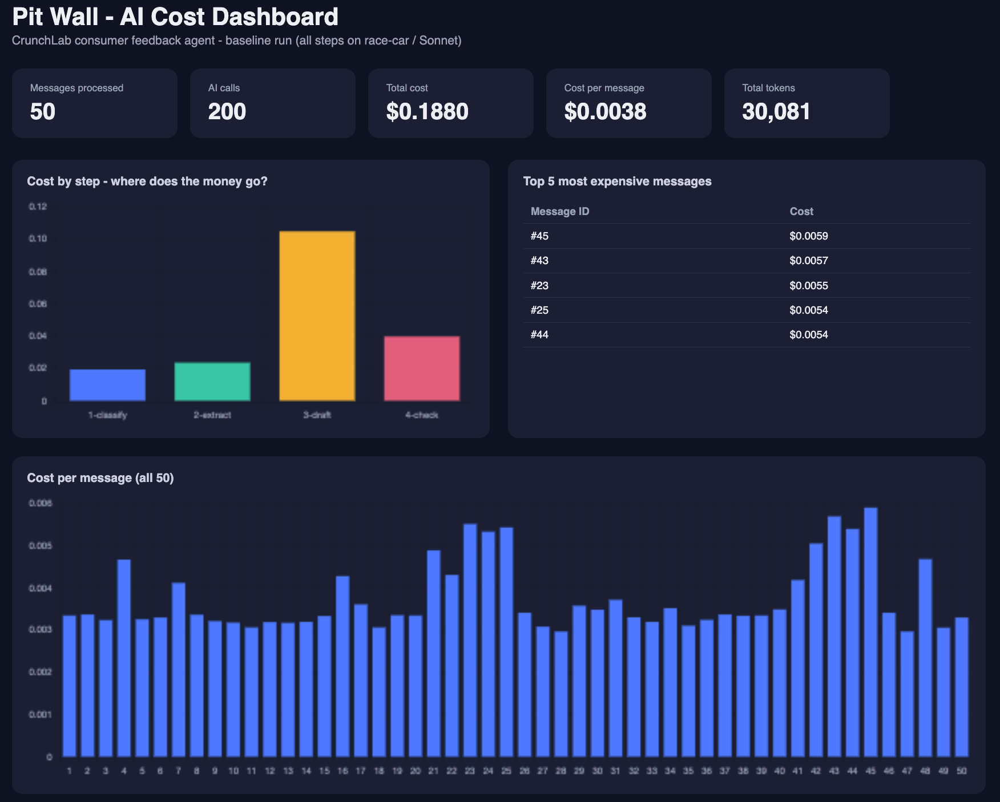

# 🏎️ Pit Wall — FinOps for an AI Agent

**One-line summary:** I put a cost-metering proxy (LiteLLM) in front of a multi-step AI agent, measured cost per task and per step, then implemented one model-routing rule that cut total cost by **38.1%** while quality held at **96% approved**.

Built by a zero-coding-background FMCG business partner, guided step-by-step by AI. Inspired by the "FinOps for AI" pillar in enterprise AI skill frameworks.



---

## The scenario

A fictional snack brand (**CrunchLab**) receives 50 consumer messages: five-star raves, pricing gripes, delivery complaints, and a few serious safety reports ("plastic in my chips", batch numbers included).

An AI agent processes every message in 4 steps:

1. **Classify** — category (packaging / taste / pricing / delivery / safety / praise) + difficulty (EASY / HARD)
2. **Extract** — product, batch number, sentiment
3. **Draft** — a consumer reply (or an urgent internal escalation memo for safety cases)
4. **Quality-check** — a second AI call verdicts the draft: APPROVED or NEEDS FIX

Every one of the 200 AI calls flows through a **LiteLLM proxy**, which logs tokens and cost per call — the "toll booth."

## Architecture

```
messages.json ──> agent.py ──> LiteLLM proxy ──> Claude models
   (inbox)         (robot)      (toll booth:        fast-car  = Haiku  (cheap)
                                 logs every          race-car = Sonnet (premium)
                                 call's cost)
                        │
                        └──> results_*.csv ──> make_dashboard.py ──> dashboard.html
                              (logbook)                               (management view)
```

## Results

| Metric | Baseline (all premium) | Routed (tire strategy) |
|---|---|---|
| Messages | 50 | 50 |
| AI calls | 200 | 200 |
| **Total cost** | **$0.1880** | **$0.1163** |
| Cost per message | $0.0038 | $0.0023 |
| **Saving** | — | **−38.1%** |
| Quality check | (not tallied) | 48/50 APPROVED (96%) |
| Total tokens (baseline) | 30,081 | — |

### The routing rule ("tire strategy")

- Step 1 triage always runs on the cheap model (triage is easy work)
- **EASY** messages → cheap model for all remaining steps
- **HARD** messages → premium model
- **SAFETY** messages → premium model **always**, regardless of difficulty — a deliberate governance rule: never cheap out on safety

### The eval

The 4th agent step is an AI quality-check on every draft. After routing, 48/50 drafts were APPROVED. The 2 NEEDS FIX cases were caught before they would reach a customer — the check works as a guardrail. Cost fell 38.1% without a quality collapse; that is the evidence the routing rule is a real saving, not a false economy.

Notable catch: for a peanut-allergy question, the draft was an internal memo instead of a customer reply — the QC step rejected it with the reason "leaves a potentially at-risk child without guidance." AI checking AI, working as intended.

## What's in this folder

- `agent.py` — baseline agent (everything on the premium model)
- `agent_v2.py` — routed agent (the tire strategy)
- `make_dashboard.py` — turns the CSV logbook into `dashboard.html`
- `config.yaml` — LiteLLM model config (fast-car / race-car)
- `messages.json` — 50 synthetic consumer messages
- `results_baseline.csv` / `results_routed.csv` — cost per call, per step, per message
- `dashboard.html` — the management dashboard (open in any browser)

## Run it yourself

```bash
pip install 'litellm[proxy]' requests
export ANTHROPIC_API_KEY='your-key'
litellm --config config.yaml          # terminal 1: the toll booth
python3 agent_v2.py                   # terminal 2: the race
python3 make_dashboard.py && open dashboard.html
```

## What I learned

- Agents don't cost like software: the same 4-step task cost $0.001–$0.006 depending on message difficulty
- Step-level metering finds the money: one step (drafting) was ~60% of total spend
- One routing rule beat the 30% cost-reduction target — and the QC step is what makes the saving credible
- The hard parts of scaling this in a real company aren't code: privacy, governance, trust, and change management

## Next steps

- Connect a real feedback source (marketplace reviews) for a specific brand
- Add spend ceilings and automatic shutoffs (kill switches)
- Move the dashboard from "photo" to "live" (scheduled runs)
